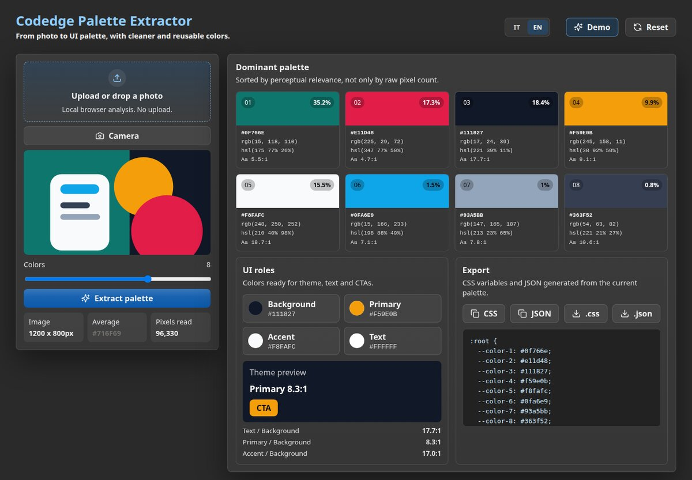

# Palette Extractor

[](https://github.com/aledtr77/palette-extractor/actions/workflows/ci.yml)
[-3fb950)](tests/)
[](LICENSE)

Pulls a colour palette out of an image and turns it into something usable: UI roles,
contrast ratios, CSS custom properties and JSON.

It runs entirely in the browser. The image is read locally and never uploaded — there
is no server and no request to send it anywhere.

**Live demo: [color-extraction.pages.dev](https://color-extraction.pages.dev/)** — built
from this repo, from this branch.

[](https://color-extraction.pages.dev/)

That is the built-in **Demo** button, not a staged screenshot — clone this repo, run it
and press the button to get the same thing. Two commands, no key, no account, nothing to
configure.

codedge.it ships this tool as one of its four as well, built into the site. This is the
tool on its own: no site around it, one concern per file, nothing to unpick before you
can read it or drop it into something else.

## What it does

- Extracts a palette from any image you give it
- Assigns the colours to UI roles instead of returning a flat list of swatches
- Computes WCAG contrast ratios and picks a readable text colour for each one
- Exports the result as CSS custom properties or as JSON

## How it works

One concern per file, so you can open the part you came for and stop there:

| File | What it holds |
| --- | --- |
| [`src/color.js`](src/color.js) | sRGB → HSL and sRGB → Lab, relative luminance, WCAG contrast ratio, perceptual distance in Lab |
| [`src/extractor.js`](src/extractor.js) | Sampling, clustering, and the pass that assigns colours to UI roles |
| [`src/camera.js`](src/camera.js) | The `getUserMedia` lifecycle and the frame grab — knows nothing about the interface |
| [`src/export.js`](src/export.js) | Clipboard and file download, with the fallback for when the Clipboard API is refused |
| [`src/render.js`](src/render.js) | Markup for the swatches, the roles and the contrast card |
| [`src/i18n.js`](src/i18n.js) | Every string the user reads, and the current locale |
| [`src/icons.js`](src/icons.js) | Lucide icon data → inline `<svg>`, so no icon font is fetched |
| [`src/template.js`](src/template.js) | The interface, as one markup string |
| [`src/main.js`](src/main.js) | Wiring only: element references, the four pieces of state, the listeners |

Start with `color.js` and `extractor.js` if you came for the colour work — they are
where the actual thinking is, and neither imports anything from the app around it.

Vanilla JavaScript and Vite, no framework. The only runtime dependency is
[`lucide`](https://lucide.dev) for the icons.

## Tests

42 tests over the part that runs without a DOM: the sRGB → HSL and sRGB → Lab
conversions, relative luminance and the WCAG ratio, the threshold that decides two
colours are the same one, the role assignment, and the CSS and JSON that come out the
other end. They check values that can be worked out by hand or come from the WCAG
definition — not what the code happens to return today, which is a test that cannot
fail for a good reason.

The one that earns its place: `readableTextColor` is swept across the whole RGB cube
and every result has to clear AA. Two colours cannot cover every background — around
L\*50 white and black are equally far away — and that sweep is what found the gap.

Extraction from a real image, the camera and the clipboard need a browser, so they are
checked in one. Lint, tests and build all run on every push.

```bash
npm test         # 42 tests (Vitest)
npm run lint     # ESLint
```

## Run it locally

Node 20.19 or newer (22.12+ on the 22 line) — what Vite 8 asks for.

```bash
npm install
npm run dev      # http://localhost:5173
npm run build    # static output in dist/
npm run preview  # serve the build
```

## Licence

Split, and the split matters — see [LICENSE](LICENSE).

**The code is MIT.** The colour maths, the extraction logic, the markup and the styles
are yours to take and build on.

**The Codedge name, logo and interface text are not.** Fork it, change it, ship it —
under your own name.
